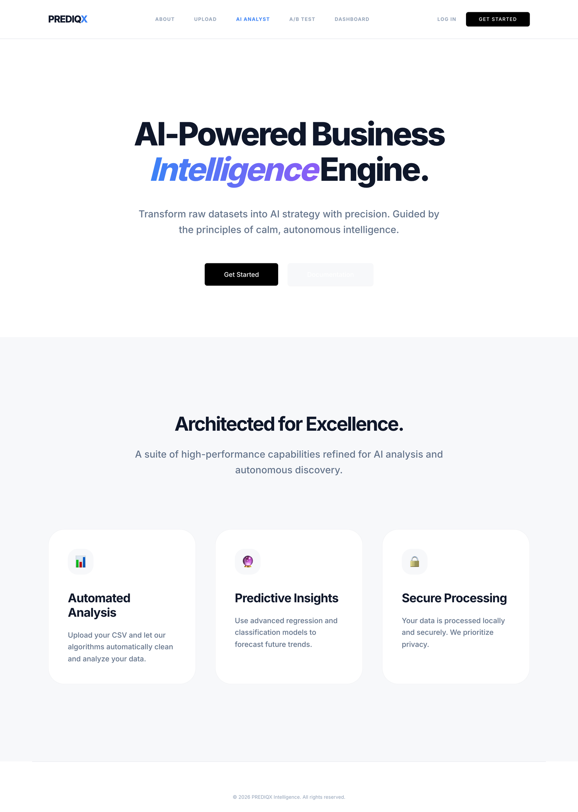
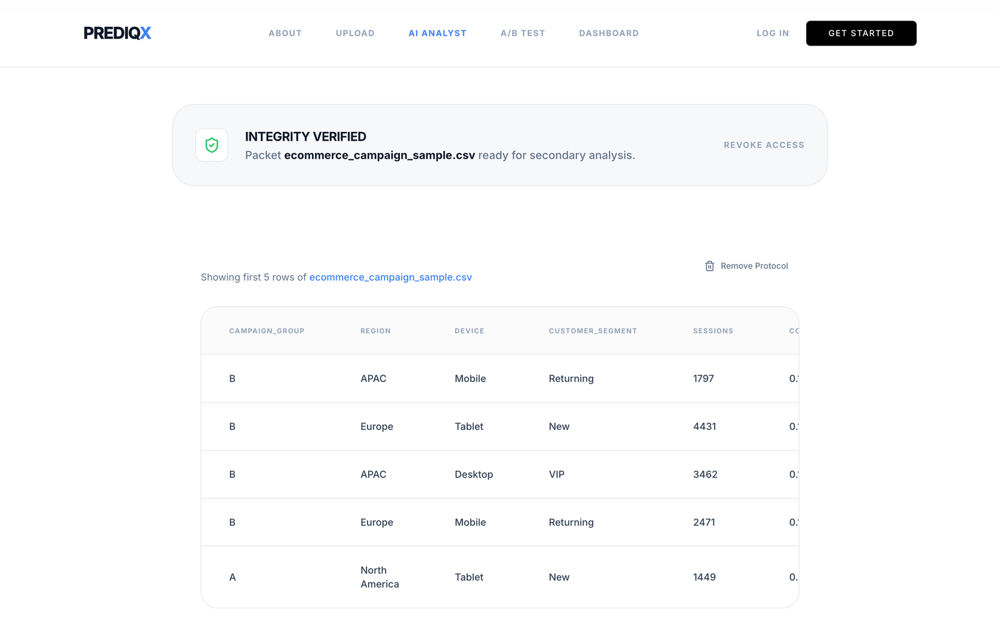
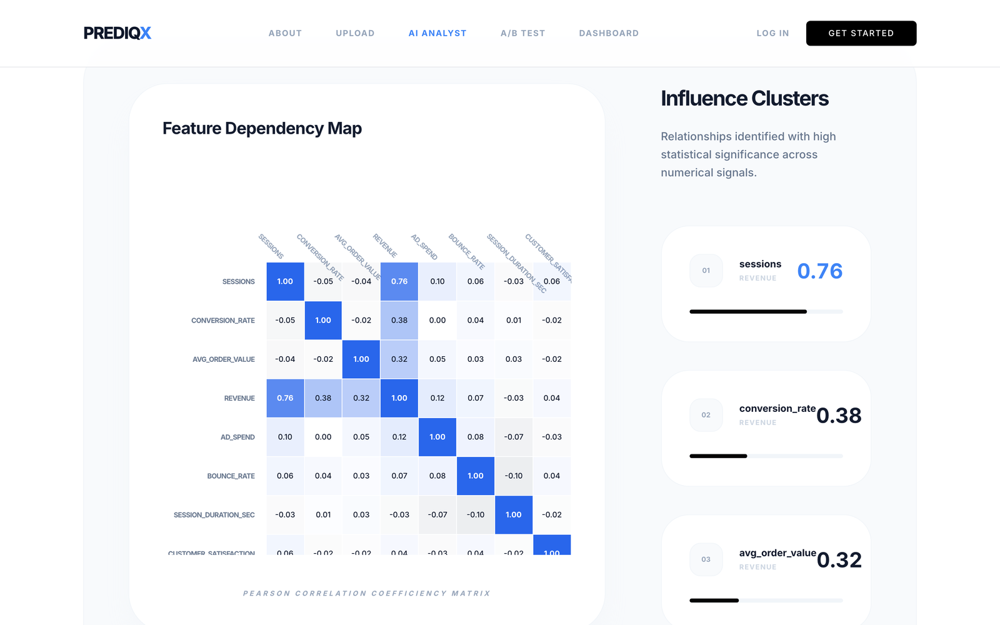
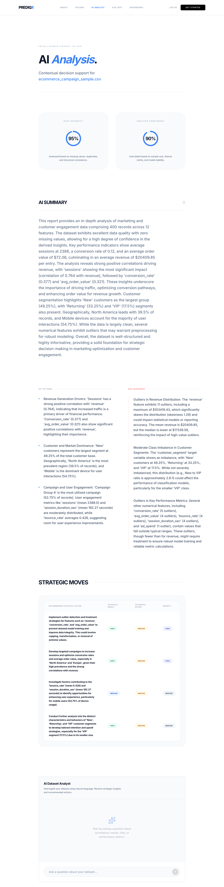
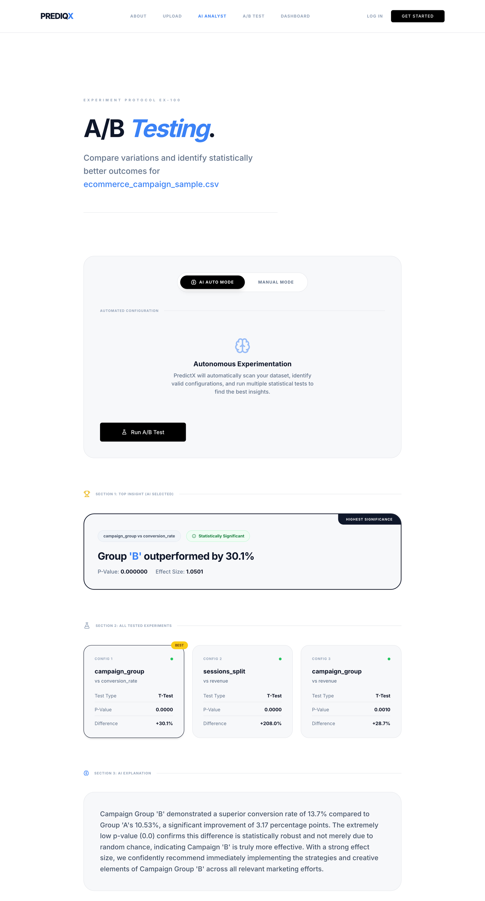

<div align="center">

# PrediqX

### AI-Powered Business Intelligence Engine

Upload a raw CSV. Get statistically-grounded EDA, an LLM-written analyst report, and automated A/B test discovery — in minutes, without writing a line of analysis code.

[](https://prediq-x.vercel.app/)


</div>

<br>



## Demo

Full walkthrough — upload a dataset, explore the auto-generated EDA dashboard, read an AI-written analyst report, and run an automated A/B test:


▶️ [Watch the full-length screen recording (.mp4)](docs/demo/demo.mp4) · 🔗 [Try it live](https://prediq-x.vercel.app/)

## What it does

PrediqX turns a CSV upload into an end-to-end analysis pipeline:

1. **Ingest** — a CSV is uploaded, validated, and profiled server-side (delimiter/encoding sniffing, null/duplicate checks).
2. **Explore** — the backend computes real descriptive statistics (mean/median/std, quartiles, outlier counts, Pearson correlation matrix) per column and renders them as histograms, boxplots, categorical breakdowns, and a correlation heatmap.
3. **Explain** — that statistical summary is handed to an LLM (Gemini or OpenAI), which writes a grounded executive report: data quality score, key patterns, risk flags, model-readiness checklist, and prioritized recommendations. No API key configured? It degrades gracefully to a deterministic offline mode instead of breaking.
4. **Experiment** — an automated A/B testing engine scans the dataset for valid group/metric column pairs, runs the appropriate statistical test (t-test / chi-square) on each, ranks them by significance, and asks the LLM to explain the winning result in plain English.

## Features

<table>
<tr>
<td width="50%" valign="top">

### 📥 Guided Ingestion
Drag-and-drop CSV upload with client-side preview, then server-side validation and a live data-preview table before analysis begins.



</td>
<td width="50%" valign="top">

### 📊 Automated EDA Dashboard
Per-column statistics, frequency histograms, boxplots, categorical distributions, and a full Pearson correlation heatmap — computed from the actual uploaded data, not canned samples.



</td>
</tr>
<tr>
<td width="50%" valign="top">

### 🧠 AI Analyst Report
An LLM reads the real EDA summary — not the raw CSV — and produces an executive report: data quality/confidence scores, key patterns, risk flags, a model-readiness checklist, and prioritized recommended actions. Includes a follow-up chat for ad-hoc questions about the dataset.



</td>
<td width="50%" valign="top">

### 🧪 Automated A/B Testing
One click scans every valid group/metric combination in the dataset, runs t-tests/chi-square tests with p-values and effect sizes, ranks them by statistical significance, and generates a plain-English explanation of the winning experiment.



</td>
</tr>
</table>

## Tech Stack

| Layer | Technology |
|---|---|
| **Frontend** | React 19, TypeScript, Vite, Tailwind CSS, Framer Motion, Recharts, React Router |
| **Backend** | FastAPI, Pandas, NumPy, SciPy, scikit-learn |
| **AI / LLM** | Google Gemini API (`google-generativeai`) with an OpenAI fallback path and a deterministic offline mode |
| **Deployment** | Vercel — static frontend + a self-contained serverless FastAPI function (`api/index.py`) |

## Architecture

This is a monorepo with two independently-runnable halves and a slimmed-down serverless copy of the API for production:

```
capstone/
├── src/                      # React + TypeScript frontend (Vite)
│   ├── pages/                 # LandingPage, UploadPage, Dashboard, Analyst, ABTest, About
│   ├── components/            # charts/, upload/, analyst/, ui/, sections/
│   └── services/api.ts        # typed fetch client for the backend
│
├── backend/                  # FastAPI app used for local development
│   └── app/
│       ├── api/v1/endpoints/  # upload, ml, analyst, ab_testing
│       ├── services/          # data_processor, ab_testing_service, ml_engine, llm_engine
│       └── core/config.py
│
├── api/index.py               # self-contained FastAPI function for Vercel's serverless runtime
│                               # (mirrors backend/, kept dependency-light so the bundle stays small)
├── vercel.json                 # rewrites /api/* → the serverless function, everything else → the SPA
└── start.sh                    # one-command local dev: backend on :8000, frontend on :5173
```

**Why two backends?** `backend/` is the full FastAPI service used for local development (`start.sh`). `api/index.py` is a deliberately self-contained, dependency-light mirror of the same endpoints, built specifically to fit Vercel's serverless function constraints — it doesn't import from `backend/` so the deployed bundle stays small.

## Getting Started

**Prerequisites:** Node.js 18+, Python 3.10+

```bash
git clone https://github.com/faheem-farooq/capstone.git
cd capstone
./start.sh
```

`start.sh` installs backend dependencies into `backend/vendor/` if missing, launches the FastAPI backend on `:8000`, then starts the Vite dev server on `:5173`.

### Enabling the AI Analyst

Without an API key, the AI Analyst and A/B test explanations run in a deterministic **offline mode** so the app still fully works out of the box. To get live, dataset-grounded LLM output, add a key:

```bash
# backend/.env  (gitignored — never commit this file)
GOOGLE_API_KEY=your_gemini_api_key   # or OPENAI_API_KEY=your_openai_key
```

Restart the backend after adding the key.

## API Overview

All endpoints are namespaced under `/api/v1`:

| Method | Endpoint | Description |
|---|---|---|
| `POST` | `/data/upload` | Upload and validate a CSV |
| `GET` | `/data/eda/{file_id}` | Full statistical EDA summary for a dataset |
| `POST` | `/analyst/report` | Generate the AI Analyst executive report |
| `POST` | `/analyst/ask` | Follow-up Q&A against a dataset's EDA context |
| `POST` | `/experiment/ab-test` | Run a manual or fully-automated A/B test |
| `POST` | `/ml/train` | Train a baseline classification/regression model and return metrics + feature importance |

Interactive Swagger docs are available at `/docs` when the backend is running locally.

## Roadmap

- [ ] Wire the existing `/ml/train` baseline-model endpoint into a dedicated frontend page
- [ ] Persistent storage for uploaded datasets (currently local disk / `/tmp` on serverless)
- [ ] Automated test suite (`backend/tests/`)

---

<div align="center">

Built by [Faheem](https://github.com/faheem-farooq)

</div>
